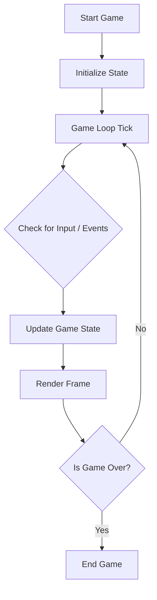

# Game of Life

---

<<< @/../examples/scripts/GameGrid.js#constructor

---

```mermaid
flowchart TD
    A[Start Game] --> B[Initialize State]
    B --> C[Game Loop Tick]
    C --> D{Check for Input / Events}
    D --> E[Update Game State]
    E --> F[Render Frame]
    F --> G{Is Game Over?}
    G -- No --> C
    G -- Yes --> H[End Game]

```

---
layout: center
---

# 5min Pause

---
layout: center
---

# 10min Pause